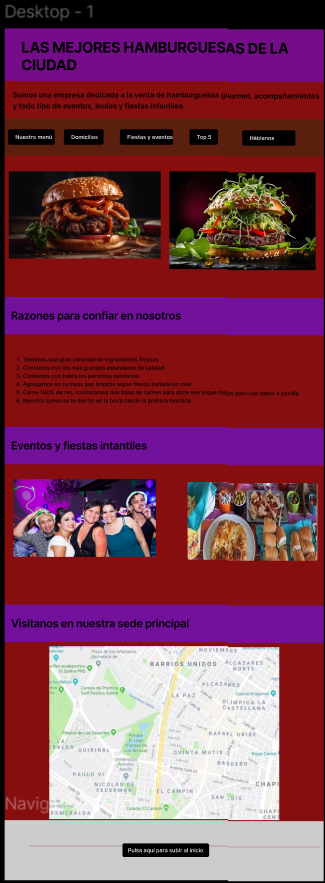

# BIT-1 - Sitio web sobre una pagina de comida rápida

# titulo
La Suprema Hamburguesería

# descripción

ste proyecto web es un sitio responsive que habla sobre mi negocio de hamburguesas llamado la suprema hamburgueseria diseñado con Html, Css, Boostrap, Javascript, siendo muy agradable a la vista y espero que les guste

# Tecnologías utilizadas

- HTML
- CSS
- Boostrap 5
- Javascript
- Git y Github 

# Enlaces para la entrega del proyecto

# Figma

Enlace figma: - Figma link ( https://www.figma.com/design/FMi4cALvswvvMG24xw6K6U/Untitled?node-id=23-4&t=a17W4fiPFbfekAFq-1)

# Github pages

https://albertobastidas1990.github.io/bit-1/

# Github URL de acceso público

https://github.com/Albertobastidas1990/bit-1.git

# Autor

Alberto Andrés Bastidas Méndez

